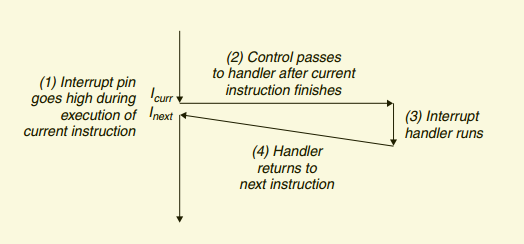
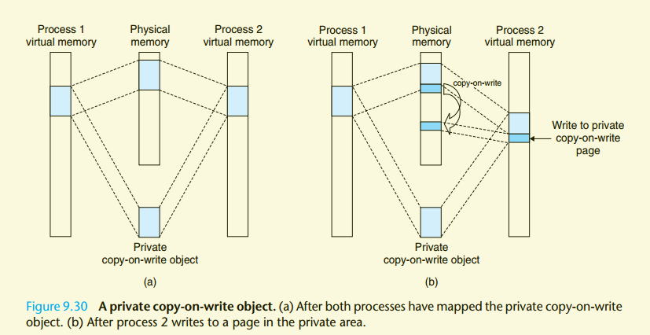
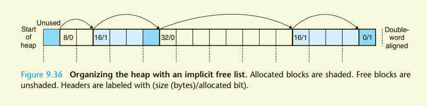

# 1. c编译成汇编指令

```shell
gcc -Og -S 3.28.c
gcc -O1 -S 3.28.c
# 生成的可执行文件包含debug相关信息
gcc -g -o 3.28 3.28.c
```
- -Og 代表不进行编译器优化
- -O1 代表进行1级优化

# 2. gdb调试工具
```shell
# 启动调试
gdb prog
# 进入调试界面后
break main  # 在main方法上打断点
run # 开始调试运行
next # 下一步， 不会进入子程序， 简写n
nexti 8 # 往下执行8步
step # 下一步， 会进入子程序， 简写s
stepi 8 # 往下执行8步
continue # 跳转到下一个断点
disassemble # 泛编译当前断点所在的方法
disassemble main # 反编译main方法
x /8xb 0x555555754fe8 # 打印0x555555754fe8作为起始地址内存中连续8个byte的值，以16进制表示
info registers # 查看所有寄存器的值
info registers rax # 查看所有寄存器ax的值
```

# 3. 对c生成的可执行文件进行反汇编
```shell
objdump -d prog
```

# 4. 采用avx2指令输出浮点数指令
```shell
gcc -Og -mavx2  -S 3.11.1.c
```

# 5. gnu内置性能分析工具使用案例 gprof
```shell
# 1. The program must be compiled and linked for profiling. With gcc (and other
# C compilers) this involves simply including the run-time flag ‘-pg’ on the
# command line:
unix> gcc -O1 -pg prog.c -o prog

# 2. The program is then executed as usual:
unix> ./prog file.txt

# It runs slightly (around a factor of 2) slower than normal, but otherwise the
# only difference is that it generates a file gmon.out.

# 3. gprof is invoked to analyze the data in gmon.out.
unix> gprof prog
```

# chapter7 Linking
## 7.1 compiler drives
### 编译两个有关联关系的c文件
```shell
unix> gcc -O2 -g -o p main.c swap.c
```
### 编译过程
c proprocessor(cpp) ==> c compiler(cc1) ==> assembler(as) ==> linker(ld)

### gcc应用c compile, 产生可连接的.o文件
```shell
# 只编译不链接
unix> gcc -c main.c swap.c
# 将两个.o文件链接生成可在执行文件
unix> gcc main.o swap.o -o p
```

### 链接过程主要执行的两个任务
- 符号解析(symbol resolution)
- 内存相对位值重排(relocation)
## 7.4 Relocatable Object File
- gcc 编译生成的.o或可执行的文件， 称之为ELF，(Executable And Linkeable File)
- 读取ela文件的工具
    ```shell
        unix> readela -a main.o
    ```
- ela结构
    > | part | description |
    > |-|-|
    > |ELA header|头部概要信息，位值为0|
    > | .text | 编译后的可执行的程序机器码
    > | .rodata | readonly data, 比如printf中的格式化文本，jump table中的switch语句 | 
    > | .data | Initialized global C variables |
    > | .bss | Uninitialized global C variables, 仅仅只是占位符， 在ela文件中不占据存储空间 |
    > | .symtab | 这个程序中申明以及使用到的全局变量或方法信息，不包含方法内部的局部变量信息 |
    > | .rel.text | 在link过程中，.text部分需要被修改的部分 |
    > | .rel.data | 在link过程中，.data部分需要被修改的部分 |
    > | .debug | 存储一些用于调试的符号信息：本地变量，全局变量，源码信息等等。在编译时添加-g可生成此部分 |
    > | .line | 在text部分的代码，和源码的行号关系，在编译时添加-g可生成此部分 |
    > | .strtab| 字符串表 |
    > | Section header table| 

## 7.5 Symbol Tables
.symtabs的数据结构
```c
 typedef struct {
    int name; /* String table offset */
    int value; /* Section offset, or VM address */
    int size; /* Object size in bytes */
    char type:4, /* Data, func, section, or src file name (4 bits) */
    binding:4; /* Local or global (4 bits) */
    char reserved; /* Unused */
    char section; /* Section header index, ABS：不需要relocation的符号, UNDEF: 未在当前module定义, Or COMMON:未初始化的全局变量 */
 } Elf_Symbol;
```

## 7.6 符号解析（Symbol Resolution）
- 符号分类： 
    - strong symbol（初始化的的全局变量，全局方法，并且未被static修饰）
    - weak symbol(未初始化的全局变量，static修饰的方法和变量)
- 同名符号的处理方式：
    - link过程中，不允许有两个相同的strong symbol，否则直接中断
    - 两个同名symbol, 一个strong, 一个weak, 选用strong
    - 两个同名weak symbol, 随意选一个  

### 1.  在链接中使用静态库(Linking with Static Libraries)
- 静态库： 一些列可链接文件（elf）的集合(archive)，高效利用基础库. 一般文件名以.a
- 创建静态库的方式
```shell
unix> gcc -c addvec.c multvec.c
# 创建静态库：libvector.a
unix> ar rcs libvector.a addvec.o multvec.o
# 使用静态库用于编译, 注意：静态库和当前模块的前后顺序很重要，被依赖的静态库要放在右边
# 如果a.c编译以来libx.a, 而libx.a和liby.a又互相依赖，则书写方式: gcc -o a a.c libx.a liby.a libx.a
unix> gcc -o usevec usevec.c libvector.a
```

## 7.7 重构（Relocation）
### 1. relocation的两步
- Relocating sections and symbol definitions. 将elf文件相同的section合并，比如两个文件中的.data部分，形成最终的run-time memory address
- Relocating symbol references within sections. 将需要重构的符号部分，修改为最终的runtime address

### 2. relocation entry的结构
```c
typedef struct {
    int offset; /* Offset of the reference to relocate */
    int symbol:24, /* Symbol the reference should point to */
    type:8; /* Relocation type： 有两种比较重要：R_386_PC32（相对地址）， R_386_32（绝对地址） */
} Elf32_Rel;
```
每一条relocation entry数据在link阶段，必须被合理合法替换  
比较重要的两种type
- Relocating PC-Relative References 使用相对地址替换，比如call指令
- Relocating Absolute References 使用绝对地址替换，比如gobal全局变量的使用

## 7.8 Executable Object Files(可执行文件)
- 可执行文件的ela结构（与relocatable object file类似）
    > | part | description |
    > |-|-|
    > |ELA header|头部概要信息，位值为0|
    > |Segment header table| |
    > | .init | 定义的_init函数，在程序初始化时期调用 |
    > | .text | 编译后的可执行的程序机器码
    > | .rodata | readonly data, 比如printf中的格式化文本，jump table中的switch语句 |
    > | .data | Initialized global C variables |
    > | .bss | Uninitialized global C variables, 仅仅只是占位符， 在ela文件中不占据存储空间 |
    > | .symtab | 这个程序中申明以及使用到的全局变量或方法信息，不包含方法内部的局部变量信息 |
    > | .rel.text | 在link过程中，.text部分需要被修改的部分 |
    > | .rel.data | 在link过程中，.data部分需要被修改的部分 |
    > | .debug | 存储一些用于调试的符号信息：本地变量，全局变量，源码信息等等。在编译时添加-g可生成此部分 |
    > | .line | 在text部分的代码，和源码的行号关系，在编译时添加-g可生成此部分 |
    > | .strtab| 字符串表 |
    > | Section header table|

- Read-only memory segment(code segment)包含的部分：
    - .init
    - .text
    - .rodata
- Read/write memory segment(data segment)包含的部分：
    - .data
    - .bss
- 运行期间不加载进内存的部分：
    - .symtab
    - .debug
    - .line
    - .strtab

## 7.9 Loading Executable Object File(加载可执行文件)
- 1. 当执行
```shell
unix> ./p
```
时，unix系统调用*execve*函数， 将可执行文件从硬盘加载到内存
- 2. 跳转到程序入口，一般是crt1.o中的_start方法

## 7.10 Dynamic Linking with Shared Libraries(share object)
- 与static libary相比的优点
    1. 没必要每次都将常用的方法链接到elf文件中，避免生成的可执行文件太大
    2. 库发生变更后，不需要使用客户重新链接
    3. 节约运行时内存，借助PIC， 多个进程可共享同绝对内存地址中的方法
- 工作原理
    > 在run-time期间，这些依赖的共享库中的方法，加载到某个固定的内存空间，调用该方法的ip指向这个固定地址
- 构建一个共享库
    ```shell
    # 构建共享库
    unix> gcc -shared -fPIC -o libvector.so addvec.c mulvec.c
    # 使用共享库参与编译
    unix> gcc -o p2 usevec.c ./libvector.so
    # 运行时，会从当前目录查找./libvectro.so
    unix> ./p2
    ```

## 7.11 Loading and Linking Shared Libraries from Applications(运行时添加共享库)
### 1. 特点
- 不需要共享库参与编译
- 运行时，按需动态加载
### 2. linux下实现动态加载方式: linux操作系统提供了一套api
```c
#include <dlfcn.h>

/**
 * 打开共享库
 * @param filename: 共享库所在路径
 * @param flag: 打开方式：RTLD_LAZY-懒加载；RTLD_NOW-立即加载
 * @return 正常时返回指向handle的指针; error时，返回NULL
 * 
 * /
void *dlopen(const char *filename, int flag);

/**
 * 从共享库中找到对应符号的链接
 * @param handle: 动态库句柄，即dlopen的正常返回值
 * @param symbol: 需要查询的符号
 * @return 正常时返回symbol的指针； error时，返回NULL
 * 
 * /
void *dlsym(void *handle, char *symbol);

/**
 * 关闭对共享库的引用
 * @param handle: dlopen的正常返回值
 * @return 正常时返回0； error时返回-1
 * /
int dlclose (void *handle);

/**
 * 获取dlopen, dlsym, dlclose异常时抛出的信息
 * @return 如果前一个操作有异常信息抛出，则返回异常信息；若前一个操作正常，则返回NULL
 * /
const char *dlerror(void);
```
### 3. dl库使用案例
```c
#include <stdio.h>
#include <stdlib.h>
#include <dlfcn.h>

int x[2] = {1, 2};
int y[2] = {3, 4};
int z[2];

int main()
{
    void *handle;
    void (*addvec)(int *, int *, int *, int);
    char *error;

    /* Dynamically load shared library that contains addvec() */
    handle = dlopen("./libvector.so", RTLD_LAZY);
    if (!handle)
    {
        fprintf(stderr, "%s\n", dlerror());
        exit(1);
    }

    /* Get a pointer to the addvec() function we just loaded */
    addvec = dlsym(handle, "addvec");
    if ((error = dlerror()) != NULL)
    {
        fprintf(stderr, "%s\n", error);
        exit(1);
    }

    /* Now we can call addvec() just like any other function */
    addvec(x, y, z, 2);
    printf("z = [%d %d]\n", z[0], z[1]);

    /* Unload the shared library */
    if (dlclose(handle) < 0)
    {
        fprintf(stderr, "%s\n", dlerror());
        exit(1);
    }
    return 0;
}
```
编译方式
```shell
# -ldl 由于使用到了dlfcn.h， 需要显示得将dl库添加到编译过程中
unix> gcc -rdynamic -o p3 dldemo.c -ldl
```

## 7.12 Position-Independent Code(PIC)
- 实现PIC Data Reference
    - 靠全局变量的实现，无论在任何内存地址加载可执行文件，全局变量的相对地址时固定的
    - 如果可执行文件使用了share library的全局变量，编译器会在elf的.data部分创建GOT(global offset table)

- 实现PIC Function Call
    - 如果可执行文件使用了share library的全局方法，编译器会在elf的.text部分创建PTL(procedure linkage table)
    ```
    需要动态替换的entry
    Relocation section '.rela.plt' at offset 0x608 contains 3 entries:
    Offset          Info           Type           Sym. Value    Sym. Name + Addend
    000000200fc0  000200000007 R_X86_64_JUMP_SLO 0000000000000000 __stack_chk_fail@GLIBC_2.4 + 0
    000000200fc8  000300000007 R_X86_64_JUMP_SLO 0000000000000000 printf@GLIBC_2.2.5 + 0
    000000200fd0  000800000007 R_X86_64_JUMP_SLO 0000000000000000 mulvec + 0
    ```

    - got部分
    ```
    fa8: a8 0d 20 00 00 00 00 00  # got[0], address of .dynamic section
    fb0: 00 00 00 00 00 00 00 00  # got[1], identifying info for the linker
    fb8: 00 00 00 00 00 00 00 00  # got[2], entry point in dynamic linker
    fc0: 86 06 00 00 00 00 00 00  # got[3], address of pushl in __stack_chk_fail
    fc8: 96 06 00 00 00 00 00 00  # got[4], address of pushl in printf
    fd0: a6 06 00 00 00 00 00 00  # got[5], address of pushl in mulvec
    ```

    - plt的代码为
    ```asm
    Disassembly of section .plt:
    ; plt[0]
    0000000000000670 <.plt>:
    670:   ff 35 3a 09 20 00       pushq  0x20093a(%rip)        # 200fb0 <_GLOBAL_OFFSET_TABLE_+0x8>
    676:   ff 25 3c 09 20 00       jmpq   *0x20093c(%rip)        # 200fb8 <_GLOBAL_OFFSET_TABLE_+0x10>
    67c:   0f 1f 40 00             nopl   0x0(%rax)
    ; plt[1]
    0000000000000680 <__stack_chk_fail@plt>:
    680:   ff 25 3a 09 20 00       jmpq   *0x20093a(%rip)        # 200fc0 <__stack_chk_fail@GLIBC_2.4> ; jmp to *got[3]
    686:   68 00 00 00 00          pushq  $0x0
    68b:   e9 e0 ff ff ff          jmpq   670 <.plt>

    ; plt[2]
    0000000000000690 <printf@plt>:
    690:   ff 25 32 09 20 00       jmpq   *0x200932(%rip)        # 200fc8 <printf@GLIBC_2.2.5> ; jmp to got
    696:   68 01 00 00 00          pushq  $0x1
    69b:   e9 d0 ff ff ff          jmpq   670 <.plt>

    ; plt[3]
    00000000000006a0 <mulvec@plt>:
    6a0:   ff 25 2a 09 20 00       jmpq   *0x20092a(%rip)        # 200fd0 <mulvec> ; jmp to *got[5]
    6a6:   68 02 00 00 00          pushq  $0x2
    6ab:   e9 c0 ff ff ff          jmpq   670 <.plt>
    ```
- mulvec的具体调用过程
    1. 跳转转到plt[3] 6a0
    2. 如果时第一次调用，则跳转到*(fd0), 也就是6a6, 将这个方法的id（也就是2）压栈
    3. 跳转到plt[0] 670
    4. 将gto[1]的值, 也就是linker id的指针压栈
    5. 跳转到gto[2]内存中存储的地址，也就是linker中的入口
    6. 执行share lib中的mulvec方法，并将这个方法的值存放到gto[5]中
    7. 下次在调用mulvec方法，在第2步时就可以直接跳转到目标方法

## 7.13 linux中常用分析工具
- ar 用与创建static library, 插入，删除，查看以及提取其中的成员
- strings 打印object file中所有可以打印的文本
- nm 打印所有symbol table
- size 输出elf各个部分的大小
- **readelf -a** 打印elf所有头文件
- **readelf -x** 打印elf所有头文件
- **objdump -d** 打印elf文件中.text的汇编部分
- ldd 展示一个可执行文件在运行时需要的share library

# 8. Exceptional Control Flow 异常控制流程
## 8.0. ECF(Exception control flow)
ECF的重要体现
- 操作系统实现的I/O，进程，虚拟内存，都是已ECF为基础
- 应用程序和操作系统交互也时基于ECF实现（trap， system call）
- 使用ECF可以创建进程，等待进程终止，通知其他进程，以及响应其他进程事件
- 并发（concurrency）也是基于ECF
- 理解软件层面的异常，比若c++/java中的try-catch
## 8.1 Exception 异常
- 异常处理完成后，由三种后续流程
    - 跳转到发生异常的指令地址
    - 跳转到发生异常指令的下一条指令地址
    - 终结产生异常的程序
### 1. Exception Handling 异常处理
每种异常由一个唯一的Exception Number表示  
Exception Number种类：
- 处理器定义的异常，包括：
    - divide by zero
    - page faults
    - memory access violations
    - breakpoints
    - arithmetic overflows
- 操作系统内核定义的异常，包括：
    - system calls 
    - signals from external I/O devices

异常由一个exception table维护，操作系统启动时，会将这个异常表加载到内存中  
exception table结构
|address|description|
|-|-|
xxx|code address for exception number 0
xxx|code address for exception number 1
xxx|code address for exception number 2
...|...
xxx|code address for exception number n-1

发生异常时，根据exception number从exception table中查找对应的exception handle code的地址

exception table的起始内存地址存放在**exception table base register**中。  
异常处理过程与程序调用的差异点：
- 调用前，根据异常类型push当前指令地址或下一条指令地址到stack中
- 为了方便异常处理后的程序恢复，异常处理前会将一些额外处理器信息压栈
- 当控制权从user program转移到kernel时，需要压栈的信息是push到kernel的栈中，而不是当前user的栈中
- exception handle运行在kernel mode，对所有的系统资源有完全控制权

### 2. 异常的类型
#### 四种基本类型

类型|发生场景|同步/异步|返回行为
-|-|-|-|
中断(interrupt)|I/O设备发出的信号|异步|返回到下一条指令
陷阱(trap)|特意设计的异常|同步|返回到下一条指令
故障(fault)|潜在的可恢复错误|同步|可能返回到当前指令
终止(abort)|不可恢复的错误|同步|不返回，直接终止异常程序

#### 中断（interrupt）执行流程：
    1. 当执行到I<sub>curr</sub>时，从system bus接受到了一个interrupt, **先将当前指令执行完**
    2. 根据exception number找到对应的interception handler
    3. 运行对应的interception handler
    4. 返回到I<sub>next</sub>指令继续执行
interrupt执行的净结果就像没有发生过interrupt一样，而其他三种exception均是由执行某条instruction导致的，这些指令被称之为*faulting instruction*



#### 陷阱和系统调用(trap and system call)
trap最重要的用途是用来实现system call.(user program和kernel之间的互相调用), 这种调用与call调用类似，但trap是运行在kernel mode下

通过```syscall n```的方式调用第n号系统服务，调用流程图如下：


#### 故障（fault）
发生在指令某执行过程中，发生了故障，交由对应的exception handler执行，如果执行后，修复了异常情况，则返回到I<sub>next</sub>继续执行，如果异常未被修复，则abort,终止应用程序的运行  

经典fault: page fault exception  


#### 终止(abort)
发生的不可修复的致命错误，直接终止应用程序的运行


### 3. Linux系统中的Exception
目前设计共有256种异常，0-31这32种异常由处理器(cpu)定义，32-255由操作系统定义
#### 操作系统种常见exception number
Exception number|Description|Exception Class
-|-|-
0|Divide error |Fault
13|General protection fault |Fault
14|Page fault |Fault
18|Machine check |Abort
32–127|OS-defined exceptions |Interrupt or trap
128|(0x80) System call |Trap
129–255|OS-defined exceptions | Interrupt or trap

#### 系统调用
由于int 0x80是运行在kernel model下，不能通过栈传递值，只能依赖寄存器传递值
- %rax: 用于传递调用的系统服务编号（syscall number）
- 其他参数按如下顺序传递：%rbx, %rcx, %rdx, %rsi, %rdi, %rbp

#### 一段简单的为伪代码，利用int 0x80向控制台打印hello world
```asm
 .section .data
 string:
 .ascii "hello, world\n"
 string_end:
 .equ len, string_end - string
 .section .text
 .globl main
 main:
; First, call write(1, "hello, world\n", 13)
 movl $4, %eax ;System call number 4
 movl $1, %ebx ;stdout has descriptor 1
 movl $string, %ecx ;Hello world string
 movl $len, %edx ;String length
 int $0x80 ;System call code

; Next, call exit(0)
 movl $1, %eax ;System call number 0
 movl $0, %ebx ;Argument is 0
 int $0x80 ;System call code
```
## 8.2 进程(Processes)
多线程的实现也是依赖interrupt机制
### 1. 逻辑控制流(Logical Control Flow)
虽然在一段时间内，可能由多个线程同时执行，但逻辑上看起来就像cpu被某个线程独占，逻辑控制流也就是这个线程看起来独占执行的流程，展示如下：  
  
processA的整个执行生命周期是一个逻辑控制流，processB, processC同样也是

### 2. 并发流(Concurrent Flow)
逻辑控制流执行时间与其他逻辑控制流有交叉的部分，这个逻辑控制流称之为**并发流**, 这两个流称之为并发运行，比如A和C并发运行，而B和C就不属于并发运行。

每一个线程执行的占用的一小段时间称之为**time slice**, processA由两个time slice组成。

并发流的形式：
- 多个线程在一个processor上执行
- 多个线程在不同processor或计算机上执行，这种称之为：并行流（parallel flow）

### 3. 进程私有化内存
每个进程都有一段结构化的私有内存，user mode下，这段内存进程间不能互相访问

其结构如下：  


64位系统线程私有地址从0x0040000000开始，32位从0x08048000开始。在0~私有化线程地址开始这段内存，保留给kernel使用，包含kernel需要使用到的code, data, stack. 比如在执行system call时会用到

### 4. 两种运行模式
- user mode
    - 不允许执行需要特权的指令，比如终止进程，修改mode bit，开启一个io操作
    - 不允许直接访问kernel区域的地址空间
    - 可以通过system call间接访问kernel区域的地址空间
    - 大部分都运行在此种模式，只有exception出现时，才切换到kernel mode，exception handle处理完返回后，切会到user mode
    - linux下可通过/proc/目录下的文件系统访问kernel区的数据
- kernel mode
    - exception handler运行在此模式下

### 5. 进程上下文切换(context switch)
操作系统通过上下文切换实现多任务并发处理

kernel为每个进程都维护了一份context,包含当前进程register, pc, stack, kernel's status,kernel data structures, a process table(当前进程信息), a file table 用于切换后恢复当前进程

在内核种负责进程切换的称之为进程调度器**scheduler**，工作流程：
1. 保存当前进程的context
2. 恢复即将运行线程的context
3. 将控制权转交给新恢复的进程

进程context切换的时机点：
- 进程进行了system call的调用
- 发生了interrupt。操作系统在执行指令过程中，会发生周期性定时中断，一般每1～10ms中断一次，在这中断期间，系统会判断是当前进程继续执行，还是当前进程运行太久，切换context到另一个进程执行

进程切换示意图:  


#### 造成cache pollution的场景
- 发生exception时的Excption control flow, 切换到kernel mode后，context不一致，导致cache cold
- context switch. 由于发生了context switch, 切换后，cache is cold, 缓存中数据不能复用，需要重新load。

## 8.3 系统调用的异常处理
调用系统函数发生异常时，通常返回-1，并且设置一个全局变变量值：errno用于表示异常类型
```c
if ((pid = fork()) < 0) {
    fprintf(stderr, "fork error: %s\n", strerror(errno));
    exit(0);
}
```
strerror函数，根据errno返回次异常的文本信息，为了简化，创建一个异常报告函数：
```c
#include <errno.h>
#include <string.h>
#include <stdio.h>

void unix_error(char *msg) /* Unix-style error */
{
    fprintf(stderr, "%s: %s\n", msg, strerror(errno));
    exit(0);
}
```
更进一步，可以对fork函数进行代理封装
```c
pid_t Fork(void)
{
    pid_t pid;
    if ((pid = fork()) < 0)
        unix_error("Fork error");
    return pid;
}
```

## 8.4 进程控制(Process Control)
### 1. 获取进程pid
```c
#include <sys/types.h>
#include <unistd.h>
pid_t getpid(void); // 返回int型pid, 返回当前进程id
pid_t getppid(void); // 返回父进程的id
```

### 2. 进程的创建与终止
#### 进程的三种状态
- *Running*（运行中或在等待调度器调度）
- *Stopped* 进程挂起，没有在等待调度。接受到*SIGSTOP, SIGTSTP, SIGTTIN,
  SIGTTOU*会进入Stopped状态。 接受到**SIGCONT**信号后，可再度进入Running状态。
- *Terminated* 进程永久停止了。进入终止状态的三种场景
    - 接受到终止信号
    - 结束main方法
    - 调用exit函数

#### 创建进程
```c
#include <sys/types.h>
#include <unistd.h>

int main(int argc, char const *argv[])
{
    printf("before fork....\n");
    pid_t pid = fork();
    pid_t cur_pid = getppid(); // 会返回两次，一次是在当前进程(返回子进程id)，一次是在子进程(返回0)
    printf("after fork....pid=%d, cur_pid=%d\n", pid, cur_pid);
    return 0;
}
```
- fork()，返回两次，子进程返回0，父进程返回子进程id
- 创建子进程时，会将此时的父进程user-level虚拟内存空间数据(.data, .text, .bss)完全复制到子进程，子进程会得到父进程已经打开的file descriptors, 子进程也可以对这些文件读写
- 子进程和父进程并发运行
- 父进程和子进程有各自独立的私有内存空间

### 3. 子进程的回收
- 当子进程运行结束，而父进程依旧处于running状态时，此时子进程不会终止，此时未被父进程回收的子进程称之为*zombie*，僵尸进程也会占用少量空间，可通过在父进程调用waitpid函数主动收割。
- 子进程被回收的方式
  - 父进程结束时回收
  - 如果父进程结束时，子进程依旧处于running，此时的子进程依赖pid为1的init进程回收
- 父进程可以通过系统函数：waitpid等待子进程结束
```c
#include <sys/types.h>
#include <sys/wait.h>
/**
 * @param pid pid>0时，只等待这个特定子线程； pid=-1时，等待任何一个子线程结束
 * @param status 子线程退出时的状态
 * @param options: WNOHANG (直接返回，不阻塞)； WUNTRACED （返回已结束子线程的status）
 * /
// pid_t waitpid(pid_t pid, int *status, int options);
// 等代子进程结束
pid_t pid = waitpid(pid, NULL, 0);
```
- 作用在status上的几个函数
  - WIFEXITED(status): 子线程是否正常退出。（通过exit或return）
  - WEXITSTATUS(status)：子线程退出时，exit传递的值
  - WIFSIGNALED(status)：子线程是否时由于一个未捕获的信号(signal)导致子线程进入terminal状态
  - WTERMSIG(status): 返回导致子线程terminal的信号值
  - WIFSTOPPED(status): 子进程是否处于stop状态
  - WSTOPSIG(status): 返回导致子线程stop的信号值

- Error Condition
  - 当当前线程没有子线程时，waitpid返回-1，并设置errno值为ECHILD
  - 如果waitpid被一个信号打断时，返回-1，并设置errno为EINTR

- wait函数
  ```c
    #include <sys/types.h>
    #include <sys/wait.h>
    pid_t wait(int *status); // 等价与：waitpid(-1, &status, 0)
  ```

### 4. 进程休眠
- sleep函数
```c
#include <unistd.h>
/**
 * 使线程休眠，直到超时或被某个signal信号打断
 * @return return seconds left to sleep
 * /
unsigned int sleep(unsigned int secs);
```
- pause函数
```c
#include <unistd.h>
/**
 * 使线程暂停，直到比signal打断
 * @return Always returns −1
*/
int pause(void);
```

### 5. 从一个程序中加载并运行一个新程序
#### 使用execve运行一个新程序
```c
#include <unistd.h>
/**
 * @param filename 需要执行的文件名
 * @param argv 传递给main函数的argv值，这个数组最后一个元素必须是NULL
 * @param envp 传递给main函数的环境变量值，数组最后一个必须时NULL，字符串以key=value的形式，比如envp[0]="name=tom"
 * @return 正常执行时，不会返回直接结束，出现error时，返回-1
 * 
*/
// int execve(const char *filename, const char *argv[], const char *envp[]);
int rt = execve("helloworld", args, NULL);
printf("8.4.5.2, pid=%d, rt=%d\n", getpid(), rt); // 如果execve成功执行，则不会执行这行及后面行
```
- execve运行时，会在**当前进程的context环境**中加载新的程序（同时**删除老的程序相关的数据和代码**，只会继承在execve这个时刻所打开的文件），运行那个指定的程序
- execve运行的新程序，会在当前进程空间开辟一块的内存空间(user stack)，用于存放argv和envp(注意，当前程序的envp的值不会带到新程序的envp空间), 其结构如下：
-  inherit the blocked set (signal) of their parents


#### evn相关的设置
```c
#include <stdlib.h>
char *getenv(const char *name);
int setenv(const char *name, const char *newvalue, int overwrite);
void unsetenv(const char *name);
```

### 6. fork与execve组合，实现shell功能
```c
if ((pid = Fork()) == 0) { /* Child runs user job */
    if (execve(argv[0], argv, environ) < 0) {
        printf("%s: Command not found.\n", argv[0]);
        exit(0);
    }
}
```

1. fork创建子进程
2. execve运行目标程序

## 8.5 信号(Signals)
### 常见linux信号值
Number | Name | Default action | Corresponding event
-|-|-|-
1 | SIGHUP | Terminate | Terminal line hangup
2 | SIGINT | Terminate | Interrupt from keyboard
3 | SIGQUIT | Terminate | Quit from keyboard
4 | SIGILL | Terminate | Illegal instruction
5 | SIGTRAP | Terminate and dump core | Trace trap
6 | SIGABRT | Terminate and dump core | Abort signal from abort function
7 | SIGBUS | Terminate | Bus error
8 | SIGFPE | Terminate and dump core | Floating point exception
9 | SIGKILL | Terminate | Kill program
10 | SIGUSR1 | Terminate | User-defined signal 1
11 | SIGSEGV | Terminate and dump core | Invalid memory reference (seg fault)
12 | SIGUSR2 | Terminate | User-defined signal 2
13 | SIGPIPE | Terminate | Wrote to a pipe with no reader
14 | SIGALRM | Terminate | Timer signal from alarm function
15 | SIGTERM | Terminate | Software termination signal
16 | SIGSTKFLT | Terminate | Stack fault on coprocessor
17 | SIGCHLD | Ignore | A child process has stopped or terminated
18 | SIGCONT | Ignore | Continue process if stopped
19 | SIGSTOP | Stop until next SIGCONT | Stop signal not from terminal
20 | SIGTSTP | Stop until next SIGCONT | Stop signal from terminal
21 | SIGTTIN | Stop until next SIGCONT | Terminal input for background process
22 | SIGTTOU | Stop until next SIGCONT | Terminal output for background process
23 | SIGURG | Ignore | Urgent condition on socket
24 | SIGXCPU | Terminate | CPU time limit exceeded
25 | SIGXFSZ | Terminate | File size limit exceeded
26 | SIGVTALRM | Terminate | Virtual timer expired
27 | SIGPROF | Terminate | Profiling timer expired
28 | SIGWINCH | Ignore | Window size changed
29 | SIGIO | Terminate | I/O now possible on a descriptor
30 | SIGPWR | Terminate | Power failure

- 每个信号值对应着system event, 底层是通过kernel exception handler来处理

### 1. 信号相关术语
#### 信号传递过程
- **Sending a signal**. kernel将signal值更新到目标进程的某个状态值。signal发送的两个场景: 1)kernel检测到一个system event. 2) 一个进程通过kernel调用kill函数发送signal到另一个进程。一个进程也可以给自己发送信号
- **Receiving a signal**. 目标进程被kernel强制要求响应某个信号， 进程处理信号的方式
  - ignore signal
  - terminal signal
  - 通过user-level signal handler来catch signal(如下图)


#### pending signal:
- 一个发出的信号但还没被响应， 一个类型的signal只能被pending一个. 后续来了一个k类型的signal, 如果此时已有一个k类型signal信号在pending, 那么这个后到的signal会被丢弃
- 也可以block, unblock某个信号
- 每个进程维护了一个**pending bit vector**，通过这个实现signal pending
- 同时也维护了一个**blocked bit vector**， 用于实现信号阻塞

### 3. 发送信号(Sending Signal)
unix信号机制依赖进程组(process group)这一概念

#### 进程组（Process Groups）
- 获取进程组
```c
#include <unistd.h>
pid_t getpgrp(void);
```
- 设置进程组
```c
#include <unistd.h>
/**
 * @param pid 需要设置进程组的进程id， pid为0时， pid取当前进程id
 * @param pgid 进程组id，pgid为0时，pgid取pid的值
 * @param 设置成功时返回0，error时返回-1
 * 
*/
int setpgid(pid_t pid, pid_t pgid);
```

#### 通过/bin/kill给进程发送一个signal 9 (SIGKILL)
```shell
# 给groupid为15213的所有进程都发送一个SIGKILL， 杀死进程
unix> /bin/kill -9 -15213
```

#### 通过键盘输入向进程组发信号
- *Ctrl+c*向前台运行的当前进程发送一个SIGINT
- *Ctrl+z*向前台运行的当前进程发送一个SIGTSTP

#### 通过kill函数发送信号
```c
#include <sys/types.h>
#include <signal.h>
/**
 * 
 * @param pid pid大于0时，向指定pid进程发送信号； pid小于0时，向进程组为abs(pid)的所有进程发送信号
 * @param sig 发送的信号值
 * @return 正常返回0，异常则返回-1
 * 
 * 
*/
int kill(pid_t pid, int sig);
```

#### 通过alarm函数发送*SIGALRM*信号
```c
#include <unistd.h>
/**
 * secs秒后，向当前进程发送一个SIGALRM
 * Returns: remaining secs of previous alarm, or 0 if no previous alarm
*/
unsigned int alarm(unsigned int secs);
```

### 3. 接收信号(Receiving Signals)
#### 注册一个自定义signal handler
```c
#include <signal.h>
void handler(int sig)
{
    printf("child after alarm...pid = %d\n", getpid());
}
// 注册一个handler方法，当前线程接受到SIGALRM时，以同步的方式会进入到这个handler
signal(SIGALRM, handler); 
```
不能注册自定义handler的信号：
- SIGKILL
- SIGSTOP

#### 信号接受
- 信号处理过程
  1. 进程接受到Signal后，同步将控制权转移到对应的handler，执行handler方法
  2. handler执行完成后，会判断当前是否还有*unblocked pending signals*
     - 如果有，将选择一个类型的signal进行处理
     - 如果没有，则将控制权返回给程序的I<sub>next</sub>

- 如果信号没有安装对应的handler时，会走默认的处理方式。默认的处理方式有：
  - The process terminates
  - The process terminates and dumps core
  - The process stops until restarted by a SIGCONT signal
  - The process ignores the signal

#### signal函数
```c
#include <signal.h>
typedef void (*sighandler_t)(int);
/**
 * 为某种signal安装handler
 * @param signum 需要安装的signal值
 * @param handler 取值有：1) SIG_IGN, 忽略这个信号 2) SIG_DFL, 将handler恢复到系统默认的handler 3) 某个函数的地址值，自定义的handler
 * @return ptr to previous handler if OK, SIG_ERR on error (does not set errno)
 *  
*/
sighandler_t signal(int signum, sighandler_t handler);
// Returns: ptr to previous handler if OK, SIG_ERR on error (does not set errno)
```

### 4. 信号处理的一些注意问题
- Pending signals are blocked. 当一个进程正在处理k这种类型信号时，此时再来一个k类型信号，这个信号会pending，直到前一个signal处理完后，再处理这个pending signal
- Pending signals are not queued. 当一个进程正在处理k这种类型信号时，此时k类型信号最多只能pending一个，其他的k类型信号会被丢弃。(signal会记录子当前进程的某个内存地址中)
- System calls can be interrupted。System calls such as **read**, **wait**, and **accept**这些*slow system call*能够被打断.

### 5. 可以移植的signal handler
- 确保在Linux and Solaris都可准确使用，可以使用如下封装的Sginal方法
```c
#include <signal.h>
/***
 * @param signum 信号值
 * @param act 新的action
 * @param oldact 老的action
 * @return 0 if OK, −1 on error
 * /
int sigaction(int signum, struct sigaction *act, struct sigaction *oldact);
```
```c
// 自己封装一个好用的
typedef void (*sighandler_t)(int);
sighandler_t Signal(int signum, sighandler_t handler)
{
    struct sigaction action, old_action;
    action.sa_handler = handler;
    sigemptyset(&action.sa_mask); /* Block sigs of type being handled */
    action.sa_flags = SA_RESTART; /* Restart syscalls if possible */

    if (sigaction(signum, &action, &old_action) < 0)
        printf("Signal error");
    printf("install...\n");
    return (old_action.sa_handler);
}
```

### 6. 显式阻塞与解除阻塞信号(blocking and unblocking signal)
```c
#include <signal.h>
// Returns: 0 if OK, −1 on error
/**
 * 
 * @param how: 
 *              SIG_BLOCK: Add the signals in set to blocked (blocked = blocked | set).
 *              SIG_UNBLOCK: Remove the signals in set from blocked (blocked = blocked & ~set)
                SIG_SETMASK: blocked = set.
*/
int sigprocmask(int how, const sigset_t *set, sigset_t *oldset);
int sigemptyset(sigset_t *set);
int sigfillset(sigset_t *set);
int sigaddset(sigset_t *set, int signum);
int sigdelset(sigset_t *set, int signum);

// Returns: 1 if member, 0 if not, −1 on error
int sigismember(const sigset_t *set, int signum);
```

####  a classic synchronization error known as a race

### 7. 使用sigprocmask来确保多进程的同步执行问题
```c
int main(int argc, char **argv)
{
    int pid;
    sigset_t mask;

    Signal(SIGCHLD, handler);
    initjobs(); /* Initialize the job list */

    while (1)
    {
        Sigemptyset(&mask);
        Sigaddset(&mask, SIGCHLD);
        Sigprocmask(SIG_BLOCK, &mask, NULL); /* Block SIGCHLD */

        /* Child process */
        if ((pid = Fork()) == 0)
        {
            Sigprocmask(SIG_UNBLOCK, &mask, NULL); /* Unblock SIGCHLD */
            Execve("/bin/date", argv, NULL);
        }

        /* Parent process */
        addjob(pid);                           /* Add the child to the job list */
        Sigprocmask(SIG_UNBLOCK, &mask, NULL); /* Unblock SIGCHLD, 在执行unblock前，不会触发handler */
    }
    exit(0);
}
```

### 6. 非局部跳转
- 通过setjmp， longjmp组合来实现跨方法的非局部跳转
```c
#include <setjmp.h>
// Returns: 0 from setjmp, nonzero from longjmps
int setjmp(jmp_buf env);
// never return
void longjmp(jmp_buf env, int retval);
```
- 通过sigsetjmp， siglongjmp组合来实现signal handler与主程序直接的跳转
```c
#include <setjmp.h>
int sigsetjmp(sigjmp_buf env, int savesigs);
// never return
void siglongjmp(sigjmp_buf env, int retval);
```

#### setjmp设置锚点，longjmp跳转到锚点

#### setjmp/longjmp的作用
1. 用作异常处理，深层次调用发生异常时，可以直接跳转到异常处理代码区域
2. 跳出深层次调用

#### sigjmp/siglongjmp的作用
- 使得signal handler处理完成后，可以跳转到主程序的指定位值

## 8.7 进程操作使用的一些工具
- **STRACE**： 跟踪某个进程的运行状态
- **ps**： 查看所有进程信息
- **TOP**： 查看系统CPU，内存使用情况
- **PMAP**： 查进程内存布局
- **/proc**: 这个目录下包含了所有进程信息

# 9. 虚拟内存(Virtual Memory)
虚拟内存的3大作用
1. 使得main memory能够高效得充当硬盘的cache
2. 通过统一的内存地址空间，方便内存管理
3. 保护进程，防止因其他进程崩溃而影响

虚拟内存通过硬件和操作系统软件配合实现

## 9.1 物理地址与虚拟地址(Physical and Virtual Address)
cpu产生虚拟内存地址，cpu中的MMU(memory management unit)将虚拟地址转变成物理地址，从而从内存中取数

示意图:


## 9.3 虚拟内存作为缓存的一个工具（VM as a Tool for Cache）
- virtual pages(VPs)
    > 虚拟内存以固定大小的array连续区块形式连续存储在硬盘(disk)中，这个区块称之为VPs, 每页大小为: 2<sup>p</sup> bytes
    >
    VPs的三种状态
    - 未分配(Unallocated): 未和任何数据关联，不占用disk空间
    - 缓存中(Cached): vp的数据缓存在pp中
    - 未缓存(Uncached): vp的数据还未缓存在pp中  

- physical pages(PPs)
    > 物理内存存储在DRAM中，划分为多个Physical Page, 每页大小也是2<sup>p</sup> bytes

### 2. page tables
- page table为内存中的一块固定区域，用于映射disk中的vp和DRAM中的pp的关系
- page table entry的数量和vps的数量一样  


### 3. page hits
虚拟内存地址所在的vp在page table中已映射pp。(cached状态))

### 4. page faults
- 虚拟内存地址所在vp未映射pp(uncached状态)
- page fault发生后，操作系统通过fault exception flow, 将uncached的vp更新到pp中。(会驱逐一个已应缓存的pp，驱逐前会将pp数据更新到vp中)

几个概念：
- swapped in(paged in)： page从disk中加载到DRAM
- swapped out(paged out)：page从DRAM更新到disk中

### 5. allocating pages
当操作系统需要分配内存时（比如调用了malloc方法），将page table中unallocated的vp在disk中创建vp

## 9.4 VM as a Tool for Memory Management
- 在实际的操作系统中，每个进程都有一个page table, 这要使得同一个程序在不同进程运行时，都可以有一样的virtual memory address.

- 通过separate address space技术，可以带来这些好处：
  - Simplifying linking
  - Simplifying loading
  - Simplifying sharing: shared page就是存放共用的系统方法，比如：printf, fork等
  - Simplifying memory allocation
  
## 9.5 VM as a Tool for Memory Protection
通过vm, 可以实现对内存的保护.

- SUP: 必须在kernel模式下才允许access 这个vp
- READ: 是否有对这个vp有读取权限
- WRITE: 是否对这个vp有写入权限

> 如果违背了权限控制，cpu会触发fault exception, 将控制权转交给对应的execption handler, 产生一个*segmentation fault*.

## 9.6 Address Translation
> - vm address组成部分：VPN+VPO: virtual page number，virtual page offset
> - pm address组成部分：PPN+PPO: physical page number，physical page offset
> - 由于pp和vp size一致，因此转换前后，VPO=PPO


#### page hit时，地址转换过程


#### page fault时，地址转换过程.(虚拟地址对应PTE validate位为0)


### 1. VM与cache的整合
- 以virtual address为key缓存数据
- **已physical address为key缓存数据**， 大多数系统使用这种方式

### 2. 使用TLB(*Translation Lookaside Buffer*)来加速address translation
- TLB位于cpu内部，用于缓存PTE，地址翻译速度更快
- TLB每个set也可以有多路，类似cache
- 设有T=2<sup>t</sup>个TLB set， 为了查找缓存，可以将virtual address安如下拆分


- TLB hit时的地址转换过程  

- TLB miss时的地址转换过程  


### 3. Multi-Level Page Tables(多层级page table)
- 使用多级PT主要时为了节省内存，分级后，每个线程，只需要level-1的page table需要常驻内存，其他级次可以需要时才create，page in, page out.
- 2级page table示意图  


- k级page table, 只有最后一级才记录PPN  


## 9.7 linux系统，i7 cpu内存转换分析
### 1. i7 cpu结构


### 2.地址转换过程


- i7 table page采用4级
- 寄存器CR3指向L1级PT的起始位值， 某个线程都有一个地址存放CR3
- 每个进程都有一个属于它自生的PT
- 物理地址结构: 40 + 12
- 虚拟地址结构: 36 + 12
- page size: 4K

#### L1，L2，L3级PT数据结构

Field | Description
-|-
P | Child page table present in physical memory (1) or not (0).
R/W | Read-only or read-write access permission for all reachable pages.
U/S | User or supervisor (kernel) mode access permission for all reachable pages.
WT | Write-through or write-back cache policy for the child page table.
CD | Caching disabled or enabled for the child page table.
A | Reference bit (set by MMU on reads and writes, cleared by software).
PS | Page size either 4 KB or 4 MB (defined for Level 1 PTEs only).
Base addr | 40 most significant bits of physical base address of child page table.
XD | Disable or enable instruction fetches from all pages reachable from this PTE.

#### L4级(末级)PT数据结构

Field | Description
-|-
P | Child page present in physical memory (1) or not (0).
R/W | Read-only or read/write access permission for child page.
U/S | User or supervisor mode (kernel mode) access permission for child page.
WT | Write-through or write-back cache policy for the child page.
CD | Cache disabled or enabled.
A | Reference bit (set by MMU on reads and writes, cleared by software).
D | Dirty bit (set by MMU on writes, cleared by software).
G | Global page (don’t evict from TLB on task switch).
Base addr | 40 most significant bits of physical base address of child page.
XD | Disable or enable instruction fetches from the child page.

### 3. Linux Virtual Memory System

#### linux进程的虚拟内存结构


#### linux虚拟内存区域
- linux将按功能组合在一起的虚拟内存称之为area(也称之为segment), 比如(code segment, data segment， heap segment, shared library segment, user stack segment)
- linux记录（追踪这个segment的方式）
    - kernel为每个进程创建一个唯一的struct, 通过其mm可以导航到各个segment
    - pgd(page global directory): 指向当前进程的L1级page table的起始位值，当前线程恢复运行当前进程时，就是将pgd数据存入CR3寄存器
    - vm_end: 当前segment结束地址值
    - vm_start: 当前segment开始地址值
    - vm_prot: 描述当前segment所有数据的读写权限
    - vm_flags: 描述当前segment是否被其他进程共享
    - vm_next: 下一个segment的地址


#### Linux Page Fault Exception Handling
page fault 处理过程中会进行如下判断
1. Is virtual address A legal?
2. Is the attempted memory access legal? (是否有读写权限)
3. 判断是否需要从disk中加载page


### 9.8 Memory Mapping(内存映射)
- 内存映射定义：linux初始化virtual memory area时，将其关联到硬盘文件的过程
- 两种映射方法：
    - Regular file in the Unix file system: 映射到指定文件, 按page size对齐，划分到多个有规则的文件，比如an executable object file
    - Anonymous file: 映射到一个由kernel创建俄匿名文件，文件全部以bin 0的形式填充（映射到anonymous file的virtual page也被称之为*demand-zero page*）,不会真实发生swap in, swap out
- swap file也被称之为swap space, swap area

### 1. Shared Objects Revisited
swap file可分为两种类型:
1. *shared object*: 一些共用的系统方法，比如printf等，多个进程共享，避免每个进程都复制一份，节约内存  

2. *private object*： 进程私有的部分。采用copy-on-write技术实现，多个线程未修改private object部分时，还是会共享，只有某一个进程对private object部分进行修改时，才复制一份出来  


### 2. 进程内存模型中，不同区域的mapping方式


### 3. 使用mmap函数手动建立内存映射
```c
#include <unistd.h>
#include <sys/mman.h>
/**
 * @param start 虚拟内存的起始位值，一般不需要指定，设置为NUL
 * @param length 创建vm的大小
 * @param prot 对于创建的vm area的protection参数： PROT_EXEC（可执行）， PROT_READ（可读），PROT_WRITE（可写），PROT_NONE（Pages in the area cannot be accessed.）
 * @param flags 设置vm area文件映射的方式：MAP_PRIVATE，MAP_SHARED，MAP_ANON（映射到匿名文件），可通过|组合使用参数
 * @param fd 打开的文件的file descriptor
 * @param offset 指定从目标文件的某个部分开始映射
 * 
 * 
 * @return: pointer to mapped area if OK, MAP_FAILED (−1) on error
*/
void *mmap(void *start, size_t length, int prot, int flags, int fd, off_t offset;
```
#### 参数示意图:


### 4. 使用munmap删除映射的虚拟内存
```c
#include <unistd.h>
#include <sys/mman.h>

/**
 * @return 0 if OK, −1 on error
 * 
*/
int munmap(void *start, size_t length);

```

## 9.9 Dynamic Memory Allocation(动态内存分配)
使用*dynamic memory allocator*进行动态内存分配，分配出来的内存位于进程内存模型中的heap区域，brk ptr指向heap的顶部  
分配方式：
- Explicit allocators: 需要手动申请，手动释放，c中使用：malloc/free, c++中使用new/delete
- Implicit allocators: 可通过allocator自主判断是否需要释放，比如java中的gc

### 1. malloc和free函数
```c
#include <stdlib.h>
/**
 * @return: ptr to allocated block if OK, NULL on error and set errno
*/

void *malloc(size_t size);

```
- malloc申请得到的内存块里面的数据<font color='red'>不会进行初始化</font>
- calloc对malloc进行了一个封装，会对申请到的内存初始化
- realloc可以对申请到的内存大小进行调整
- malloc和free底层都是通过mmap, munmap进行实现或者通过sbrk函数实现
  
```c
#include <unistd.h>
/**
 * 通过调整brk指针的位值，进而调整使用的堆的大小
 * @return: old brk pointer on success, −1 on error and set errno to ENOMEM
*/
void *sbrk(intptr_t incr);
```

#### free函数
```c
#include <stdlib.h>
/**
 * return nothing
*/
void free(void *ptr);
```

### 2. Fragmentation(动态内存分配过程中的碎片问题)
碎片类型:
- Internal fragmentation(内部碎片)：由于内存分配时需要内存堆期，例如采用8byte对齐，当某次申请2byte时，实际会分配8个byte，因此有6个处于碎片状态，此种碎片容易统计计算
- External fragmentation(外部碎片)：处于中间某段free状态的内存（这些被释放的内存必须来自之前同一个使用了的内存块），小于当前需要的内存，也会产生碎片。
  - free(Block2)和free(Block3)来自于不同内存块的释放，所有在统计这段可用free时，不能将Block2和Block3相加
    
  - 外部碎片难以预测，一般处理方式， 内存块尽量分配大一些：attempt to maintain small numbers of larger free blocks rather than large numbers of smaller free blocks

### 3.内存分配实现过程中的一些问题
1. Free block organization: 如何管理未用的block内存
2. Placement: 如何选择一块合适的free block来存放新申请的block
3. Splitting: After we place a newly allocated block in some free block, what do we do with the remainder of the free block?
4. Coalescing（free block融合）: What do we do with a block that has just been freed?

### 4. 内存分配的一种实现方式：Implicit Free List
通过在每个block头部隐藏一个header的，形成list的管理模式
- block结构
  
- 隐式list结构
  

#### Placing Allocated Blocks
分配策略（查找适合的free block策略）:
- first fit: 从头开始查找，找到第一个合适的即可
- next fit: 从上次查找停止的地方开始查找第一个和时的
- best fit: 查找free block大小最接近需要分配大小，但需要遍历所有block，耗时
  
#### Splitting Free Blocks
如果申请的内存远小于free block, 则需要堆block拆分，避免过多internal fragmentation

#### Getting Additional Heap Memory(申请额外堆内存)
当前heap中，所有free block大小都小于申请内存时：
1. 对一些相邻的free block进行合并，合并后如果大小满足，则使用这个合并的free block
2. 如果合并后，free block依然小于申请内存，则allocator调用sbrk，重置end block， 增大heap

#### Coalescing Free Blocks
合并策略：
- immediate coalescing: 调用free后立即进行合并
- **deferred coalescing**: 延迟合并，直到某个allocate request失败时，才对整个heap扫描，进行合并。实际过程中一般常用这种

#### Coalescing with Boundary Tags
在block添加一个footer, 从header复制过来，因此可以轻易找到previous block  


> 缺点：footer需要占用额外内存，特别是当block都是很小时，此时footer占用比例高
> 优化：allocate不需要footer, 只有free block需要添加上footer

#### 整体示意：

- prologue: header(4B)+footer(4B)
- epilogue: header(4B)

### 5. 内存分配的另一种实现：Segregated Free Lists（分隔式free list）
Implicit Free List查找空闲内存的时间复杂度是O(N), 为了降低负责度，可以将list按照不同的规律，拆分成多个字list

比如如下两种划分方式: 
- 照2倍递增的方式划分  
  {1}, {2}, {3, 4}, {5−8}, . . . , {1025−2048}, {2049−4096}, {4097−∞}
- 低位按照单个内存大小分组，高位按照2倍递增划分  
  {1}, {2}, {3}, . . . , {1023}, {1024}, {1025−2048}, {2049 − 4096}, {4097−∞}

基于分隔方式实现的三种种内存管理模式
#### Simple Segregated Storage
- 每个class内部划分成大小相同的block
- 不会融合(coalesced): 导致外部碎片; 也不会拆分(split): 导致内部碎片
#### Segregated Fits
allocator维护了一个array of free lists, 每一个class中的free block形成了一条free list
- 当需要分配内存时，直接从最接近需要分配的class大小的class进行查找符合要求的free block. 采用first fit模式
- GNU malloc使用的就是这种策略
#### Buddy Systems
- 每一个class大小都是2的指数，也就是2<sup>m</sup>

## 9.10 Garbage Collection(垃圾回收)
- c/c++需要通过代码手动回收
- 高级语言（JAVA， Perl等），内置垃圾回收器，不需要手动回收
  
### 1. Garbage Collector Basics
通过root node可达到的节点代表在使用，否则代表可回收. (可达性分析)


通常root节点可能所在位置
- 寄存器
- stack
- global write/read data area

垃圾回収器类型:
- 激进型：java中的gc，认为不可达对象**一定**不会被其他地方引用，会被gc回收
- 保守型：c/c++中的gc，认为不可达对象**可能**会被其他地方引用，不会被gc回收
  
#### c/c++采用保守型的原因: 因为内存中的数据无法判断其数据类型，也就是无法区分其到底是基本数据类型，还是引用型数据类型，因此无法从root node开始得出完全正确的引用链

## 9.11 Common Memory-Related Bugs in C Programs（常见的和内存相关bug）
1. Dereferencing Bad Pointers
2. Reading Uninitialized Memory
3. Allowing Stack Buffer Overflows
4. Assuming that Pointers and the Objects They Point to Are the Same Size
   > 以为指针所占内存和int类型数据一样，32位和64位操作系统中，指针所占内存大小不一致
5. Making Off-by-One Errors
6. Referencing a Pointer Instead of the Object It Points to
7. Misunderstanding Pointer Arithmetic
8. Referencing Nonexistent Variables
```c
int *stackref ()
{
    int val; // val在栈上，随着方法的结束运行，栈会被清空
    return &val;
}
```
1.  Referencing Data in Free Heap Blocks
2.  Introducing Memory Leaks

# 10. System-Level IO
I/O(intput/output)是一个在主存和外设(硬盘/终端/网络)之间复制数据的进程

## 10.1 Unix I/O
unix的所有io设别(硬盘/终端/网路)都被模型化成文件， 便于以统一，连续的方式处理，一般操作io步骤：
1. Opening files: 请求kernel打开文件后，返回一个非负int型数，称其为**descriptor**, 在<unistd.h>中定义了三个特殊的io：
   - STDIN_FILENO: standard input (descriptor 0)
   - STDOUT_FILENO: standard output (descriptor 1)
   - STDERR_FILENO: standard error (descriptor 2)
2. Changing the current file position： 通过*seek* function, 可以设置文件读取的位值k
3. Reading and writing files
4. Closing files.

## 10.2 Opening and Closing Files

- 打开文件
```c
#include <sys/types.h>
#include <sys/stat.h>
#include <fcntl.h>
/**
 * @param flags: O_RDONLY, O_WRONLY, O_RDWR
 *              O_CREAT: 不存在则创建
 *              O_TRUNC: 存在则清空目标文件
 *              O_APPEND: 以追加模式写入
of it.
 * @return new file descriptor if OK, −1 on error
*/
int open(char *filename, int flags, mode_t mode);
```
- 使用案例
```c 
fd = Open("foo.txt", O_WRONLY|O_APPEND, 0);
```
- mode参数：为新创建的文件指定权限(permission)，位于<sys/stat.h>中的权限如下, 最终通过*mode&~mask*确定最终权限
  Mask | Description
    -|-
    S_IRUSR | User (owner) can read this file
    S_IWUSR | User (owner) can write this file
    S_IXUSR | User (owner) can execute this file
    |
    S_IRGRP | Members of the owner’s group can read this file
    S_IWGRP | Members of the owner’s group can write this file
    S_IXGRP | Members of the owner’s group can execute this file
    |
    S_IROTH | Others (anyone) can read this file
    S_IWOTH | Others (anyone) can write this file
    S_IXOTH | Others (anyone) can execute this file

- 关闭文件
```c
#include <unistd.h>
/**
 * @return  zero if OK, −1 on error
*/
int close(int fd);
```

## 10.3 读写文件(Reading and Writing Files) 
```c
#include <unistd.h>
/**
 * @return: number of bytes read if OK, 0 on EOF, −1 on error
*/
ssize_t read(int fd, void *buf, size_t n);

/**
 * @return: number of bytes written if OK, −1 on error
*/
ssize_t write(int fd, const void *buf, size_t n);

```

## 10.4 Robust Reading and Writing with the Rio Package（构建一个健壮的io读写包）
- Rio Unbuffered Input and Output Functions
- Rio Buffered Input Functions
> 每次读写一行

## 10.5 Reading File Metadata(读取文件的元数据)
```c
#include <unistd.h>
#include <sys/stat.h>
/**
 * @return: 0 if OK, −1 on error
*/
int stat(const char *filename, struct stat *buf);

/**
 * @return: 0 if OK, −1 on error
*/
int fstat(int fd, struct stat *buf);


/* 元数据结构 Metadata returned by the stat and fstat functions */
struct stat {
dev_t st_dev; /* Device */
ino_t st_ino; /* inode */
mode_t st_mode; /* Protection and file type */
nlink_t st_nlink; /* Number of hard links */
uid_t st_uid; /* User ID of owner */
gid_t st_gid; /* Group ID of owner */
dev_t st_rdev; /* Device type (if inode device) */
off_t st_size; /* Total size, in bytes */
unsigned long st_blksize; /* Blocksize for filesystem I/O */
unsigned long st_blocks; /* Number of blocks allocated */
time_t st_atime; /* Time of last access */
time_t st_mtime; /* Time of last modification */
time_t st_ctime; /* Time of last change */
};
```
- st_mode两个作用:
    1. 判断文件类型： ``` S_ISDIR(stat.st_mode) ```
        Macro | Description
        -|-
        S_ISREG() | Is this a regular file?
        S_ISDIR() | Is this a directory file?
        S_ISSOCK() | Is this a network socket?
    2. 判断文件权限: ``` stat.st_mode & S_IRUSR ```

## 10.6 Sharing Files（共享文件）
### 1. kernel描绘已打开文件的相关数据结构
- Descriptor table: 每个进程各自拥有一个descriptor table, 每个entry代表一个被打开的文件，并指向一个属于该文件的file table
- File table: 每个打开的文件对应一个file table, file table为所有进程共享， filte table的大体组成
  1. 一个指向v-node table的指针
  2. 当前文件的位值
  3. 被引用的数量(有多少个descritpor table entry指向它)
  4. 等等。。。
- v-node table: 也被所有进程共享，其中包含大部分文件的元数据信息(stat)

### 2. 每个file descriptor指向不同的file table和v-node table


### 3. 共享形式
1. 多个file table指向同一个table, 每个file table单独维护了一个postion, 读取互不干扰. 这种情况发生在调用了多次open函数


2. 多个file descriptor entry指向同一个file table, 这种情况发生在子进程创建时，继承了父进程的file descriptor.


## 10.7 I/O Redirection(IO重定向)

可使用```dup2```重定向
```c
#include <unistd.h>
/**
 * 把oldfd的descriptor复制给newfd
 * @return nonnegative descriptor if OK, −1 on error
*/
int dup2(int oldfd, int newfd);

```
- 用法:
  dup2(4,1): 将标准输入流重定向到descriptor为4的文件上


## 10.8 Standard I/O (标准iO)
ANSI C定义了一些高级io api
- fopen
- fclose
- fread
- write
- fgets
- fputs
- scanf
- printf
  
标准io中将打开的文件视为*stream*, 三个标准流
```c
#include <stdio.h>
extern FILE *stdin; /* Standard input (descriptor 0) */
extern FILE *stdout; /* Standard output (descriptor 1) */
extern FILE *stderr; /* Standard error (descriptor 2) */
```
- A stream of type FILE is an abstraction for a file descriptor and a stream buffer
- stream模式也采用了缓存机制，避免多次system call

##  10.9 Putting It Together: Which I/O Functions Should I Use?
Unix I/O, standard I/O, and Rio关系图

1. 与网络不相关的io，推荐使用stadard i/o
2. 与网络相关的io，推荐使用rio

# 11. Network Programming（网络编程）
## 11.1 The Client-Server Programming Mode
c-s请求/响应流程图


## 11.2 Networks
网络在计算机中的位置

- 网络通过网卡，io bus传递数据
- 实体网络也是层级结构
- 最底层称之为*LAN*(local area network)

LAN内部拓扑图

- hub内部采取广播方式发送内容
- hub之间定点发送（节约带宽）

LAN与WAN(wide area network)

- 为了可以跨越不同的LAN，WAN的网络媒介，在每个host和router上运行protocol software
- 这个协议提供两个基本能力
  - Naming scheme: 定义发送地址和接受地址
  - Delivery mechanism: 定义传递的文件组成：header+payload

数据在网络的传输过程


## 11.3 The Global IP Internet
- TCP(确保可靠性)/UDP(对IP的简单封装)
- IP: 只负责传送数据，可靠性不保证
### 1. IP Addresses(IP 地址)
- ip以unsigned int数据表示
```c
#include <netinet/in.h>
/* ip地址数据结构 */
struct in_addr {
unsigned int s_addr; /* Network byte order (big-endian) */
};
```
- 规定网络传输中，ip地址编码格式为：big-endian byte order
- unix中提供ip转换的函数
```c
#include <netinet/in.h>
/**
 * @return value in network byte order
*/
unsigned long int htonl(unsigned long int hostlong);
unsigned short int htons(unsigned short int hostshort);

/**
 * @return value in host byte order
*/
unsigned long int ntohl(unsigned long int netlong);
unsigned short int ntohs(unsigned short int netshort);
```
- dotteddecimal strings(128.2.194.242)与ip之间的转换
```c
#include <arpa/inet.h>
/**
 * @param: cp XXX.XXX.XXX.XXX这种形式的域名
 * @param: inp, an IP address in network byte order 
 * @return: 1 if OK, 0 on error
*/
int inet_aton(const char *cp, struct in_addr *inp);


/**
 * @param in ip on network order
 * @return pointer to a dotted-decimal string
*/
char *inet_ntoa(struct in_addr in);
```

### 2. Internet Domain Names(域名)
- 域名方便人类记忆
- 计算机沟通使用ip
- 域名级次结构： kittyhawk.cmcl.cs.cmu.edu
    
- 根域名未命名
- 二级域名
  - com
  - edu
  - org
  - net
  - gov
- ip与域名是多对多的关系，这个关系分布式存储在全球DNS(domain name system) database
  - dns每个entry结构
    ```c
    /* DNS host entry structure */
    #include <netdb.h>
    struct hostent {
        char *h_name; /* Official domain name of host */
        char **h_aliases; /* Null-terminated array of domain names */
        int h_addrtype; /* Host address type (AF_INET) */
        int h_length; /* Length of an address, in bytes */
        char **h_addr_list; /* Null-terminated array of in_addr structs */
    };
    ```
- host entry查询函数
    ```c
    #include <netdb.h>
    /**
     * @return non-NULL pointer if OK, NULL pointer on error with h_errno set
    */
    struct hostent *gethostbyname(const char *name);

    /**
     * @return non-NULL pointer if OK, NULL pointer on error with h_errno set
    */
    struct hostent *gethostbyaddr(const char *addr, int len, 0);
    ```

### 3. Internet Connections
- *socket* is an end point of a connection
- socket地址组成：ip:port
- client端发起请求时，kernel为其socket分配一个port, 称之为：*ephemeral port*
- server端socket和服务绑定，称之为：*well-known port*
- /etc/services列出了知名服务所需要的端口
- 一个连接由一个唯一的socket对组成: **(cliaddr:cliport, servaddr:servport)**

## 11.4 The Sockets Interface(socket 接口)
socket 通讯过程

### 1. Socket Address Structures(socket 地址结构)
- 从unix程序角度来看，a socket is an open file with a corresponding descriptor
- socket address结构
    ```c
    #include <sys/socket.h>
    /* Generic socket address structure (for connect, bind, and accept) */
    struct sockaddr {
        unsigned short sa_family; /* Protocol family (always AF_INET)  */
        char sa_data[14]; /* Address data. */
    };
    ```
    ```c
    #include <netinet/in.h>
    /* Internet-style socket address structure */
    struct sockaddr_in {
        unsigned short sin_family; /* Address family (always AF_INET) */
        unsigned short sin_port; /* Port number in network byte order */
        struct in_addr sin_addr; /* IP address in network byte order */
        unsigned char sin_zero[8]; /* Pad to sizeof(struct sockaddr) */
    };
    ```
- sockaddr与sockaddr_in一致，sockaddr_in为更详细的结构

### 2. socket函数
使用sokcet函数创建一个socket descriptor
```c
#include <sys/types.h>
#include <sys/socket.h>
/**
 * @return nonnegative descriptor if OK, −1 on error
*/
int socket(int domain, int type, int protocol);

//使用案例
// AF_INET: AF_INET indicates that we are using the Internet
// OCK_STREAM: indicates that the socket will be an end point for an Internet connection
clientfd = socket(AF_INET, SOCK_STREAM, 0);
```
### 3. connect函数
客户端通过connect函数向服务端建立连接
```c
#include <sys/socket.h>
/**
 * @param sockfd: 客户端创建的socket descriptor
 * @param serv_addr: 服务端socket地址
 * @param addrlen: sizeof(sockaddr_in)
 * @return 0 if OK, −1 on error
*/
int connect(int sockfd, struct sockaddr *serv_addr, int addrlen);

```
- connect函数会一直阻塞，直到成功建立连接或者发生错误
- 成功建立连接后，可以通过socket descriptor进行读写

### 4. open_clientfd
对创建socket/connect封装
```c
int open_clientfd(char *hostname, int port) {
    int clientfd = socket(AF_INET, SOCK_STREAM, 0);
    
    if(clientfd < 0) {
        return -1;
    }

    struct hostent *host = gethostbyname(hostname);
    if(host == NULL) {
        return -2;
    }

    struct sockaddr_in serveraddr;
    bzero((char *)&serveraddr, sizeof(serveraddr));
    serveraddr.sin_family = AF_INET;
    bcopy((char *)host->h_addr_list[0], (char *)&serveraddr.sin_addr.s_addr, host->h_length);

    serveraddr.sin_port = htons(port);

    // 建立连接
    if(connect(clientfd, (struct sockaddr *)&serveraddr, sizeof(serveraddr)) < 0) {
        return -1;
    }

    return clientfd;
}
```

### 5. bind函数(服务端使用)
- 服务端使用
- 将打开的socket descriptor与server端的指定socket address绑定
```c
#include <sys/socket.h>
/**
 * @return: 0 if OK, −1 on error
*/
int bind(int sockfd, struct sockaddr *my_addr, int addrlen);
```

### 6. listen函数(服务端使用)
- 服务端使用
- listen函数将active socket转变为listening socket
- 调用listen后，可以开始接受客户端的连接
```c
#include <sys/socket.h>
/**
 * @param sockfd: 打开的socket file对应的descriptor
 * @param backlog: 当请求超出backlog大小时，开始拒绝客户端的请求
 * @return: 0 if OK, −1 on error
*/
int listen(int sockfd, int backlog);
```

### 7. The open_listenfd Function
- 将socket, bind, listen进行封装
```c
int open_listenfd(int port) {
    int listenfd = socket(AF_INET, SOCK_STREAM, 0);
    
    if(clientfd < 0) {
        return -1;
    }

    // bind
    struct sockaddr_in serveraddr;
    
    int optval = 1;
    if(setsockopt(listenfd, SOL_SOCKET, SO_REUSEADDR, (void *)&optval, sizeof(int)) < 0) {
        /* Eliminates "Address already in use" error from bind */
        return -1;
    }

    bzero((char *)&serveraddr, sizeof(serveraddr));
    serveraddr.sin_port = htons((unsigned short)port);
    serveraddr.sin_family = AF_INET;
    serveraddr.sin_addr.s_addr = htonl(INADDR_ANY);

    if(bind(listenfd, (struct sockaddr *)&serveraddr, sizeof(serveraddr)) < 0) {
        return -1;
    }

    // listen
    if(listen(listenfd, 1024) < 0) {
        return -1;
    }

    return listenfd;
}
```

### 8. accept函数(服务端使用)
```c
#include <sys/socket.h>
/**
 * @param listenfd, 监听的file descriptor
 * @param clientaddr 客户端的socket addr
 * @param addrlen sockaddr长度
 * @return: nonnegative connected descriptor if OK, −1 on error
*/
int accept(int listenfd, struct sockaddr *clientaddr, int *addrlen);
```
- 服务端使用
- 服务端通过调用accept函数，来等待客户端的连接请求
- 接收到客户端的连接后，将client的socketaddr数据写入到client变量中
- 连接后，返回connected descriptor, 可通过这个descriptor读写数据
- listen descriptor和accept descriptor的区别
  - listen descriptor只会创建一次，server停止后，listen descriptor才退出
  - 服务端每次接受请求时，都会创建一个accept descriptor, 这次通讯结束后，accept descriptor就退出
- 建立连接过程
  

# 13 Concurrent Programming
实现并发的三种方法:
1. Processes
2. I/O multiplexing
3. Threads
   
## 13.1 Concurrent Programming with Processes
### 1. 使用多进程的方式实现并发方式
```c
#include <sys/types.h>
#include <sys/wait.h>

#include <sys/types.h>
#include <unistd.h>
#include <stdio.h>
#include <signal.h>
#include <stdlib.h>


void sigchld_handler(int sig)
{
    pid_t pid;
    // 通过waitpid函数收割已经运行结束的僵尸子进程
    while ((pid = waitpid(-1, 0, WNOHANG))  > 0) {
        printf("in...while...pid=%d...\n", pid);
    }
    return;
}

int main(int argc, char const *argv[])
{
    pid_t child_pid = 0;

    signal(SIGCHLD, sigchld_handler);
    for (int i = 0; i < 5; i++)
    {
        if ((child_pid = fork()) == 0)
        {
            // 子进程
            printf("child process: pid=%d\n", getpid());
            exit(0);
        }
    }

    while (1)
    {}

    return 0;
}
```
- 如果主进程以服务的方式一直在运行，需要注意对僵尸子进程的回收，避免内存泄漏

### 2. 使用多进程实现并发的利弊
- 特点:
  1. 不共享私有的进程内存空间
  2. 父子进程共享file table
- 优点：
  - 避免了进程的私有空间被其他进程误修改
- 缺点：
  - 进程之间分享状态信息比较困难(To share information, they must use explicit IPC (interprocess communications) mechanisms)
  - 并发效率较低(ecause the overhead for process control and IPC is high.)

## 12.2 Concurrent Programming with I/O Multiplexing
- 为了在一个进程内可以并发同时响应多个i/o事件，比如：接受网络socket连接同时，可以接受控制台输入
- 使用select函数实现
```c
#include <unistd.h>
#include <sys/types.h>

/**
 * @param n fdset代表fd的最大值
 * @param fd_set 需要操作的file descriptor的集合
 * @return nonzero count of ready descriptors, −1 on error
*/
int select(int n, fd_set *fdset, NULL, NULL, NULL);

FD_ZERO(fd_set *fdset); /* Clear all bits in fdset */
FD_CLR(int fd, fd_set *fdset); /* Clear bit fd in fdset */
FD_SET(int fd, fd_set *fdset); /* Turn on bit fd in fdset */
FD_ISSET(int fd, fd_set *fdset); /* Is bit fd in fdset on? */
```
### 1. 通过select函数实现io多路复用
```c
void echo(int connfd);
void command(void);

int main(int argc, char **argv)
{
    int listenfd, connfd, port;
    socklen_t clientlen = sizeof(struct sockaddr_in);
    struct sockaddr_in clientaddr;
    fd_set read_set, ready_set;

    if (argc != 2)
    {
        fprintf(stderr, "usage: %s <port>\n", argv[0]);
        exit(0);
    }
    port = atoi(argv[1]);
    listenfd = open_listenfd(port);

    FD_ZERO(&read_set);              /* Clear read set */
    FD_SET(STDIN_FILENO, &read_set); /* Add stdin to read set */
    FD_SET(listenfd, &read_set);     /* Add listenfd to read set */

    while (1)
    {
        ready_set = read_set;
        select(listenfd + 1, &ready_set, NULL, NULL, NULL);
        if (FD_ISSET(STDIN_FILENO, &ready_set))
            command(); /* Read command line from stdin */
        if (FD_ISSET(listenfd, &ready_set))
        {
            connfd = accept(listenfd, (SA *)&clientaddr, &clientlen);
            echo(connfd); /* Echo client input until EOF */
            close(connfd);
        }
    }
}
```

### 2. 优缺点
- 优点：
  - event-driven designs比process-based designs给了程序员更多的控制
  - multiplexing在一个进程内，共享该进程内的数据，更容易共享数据
  - 不需要通过切换process context实现并发，效率更高
- 缺点
  - 代码书写更复杂
  - 当某一个事件占据时间较长时，其他事件不能被及时处理
  - 不能充分利用多核处理器
  
## 12.3 Concurrent Programming with Threads
线程特征:
- thread是prcess-based和event-driven的组合
- thread由kernel自行调度
- 每个thread都拥有一个thread context, thread context结构
  - a unique integer thread ID (TID)
  - stack
  - stack pointer
  - program counter
  - general-purpose registers
  - condition codes
- 同一个进程中的所有线程共享进程的虚拟内存空间，包括：
  - code
  - data
  - heap
  - shared libraries
  - open files


### 1. Thread Execution Model
- thread context之间切换代价更小，比process context切换更快
- main thread, peer thread
- thread之间不存在父子层级关系

### 2. Posix Threads
- Posix threads (Pthreads) 是一套线程标准，在大部分unix系统中都有实现
- 当main thread调用带参数的的方法时，对象需要封装到struct
- gcc编译时，需要加上-lpthread, 因为gcc编译默认没有带上pthread
```c
#include <pthread.h>
#include <stdlib.h>
#include <stdio.h>

void *thread(void *vargp);

int main()
{
    pthread_t tid;
    pthread_create(&tid, NULL, thread, NULL);
    pthread_join(tid, NULL);
    exit(0);
}

void *thread(void *vargp) /* Thread routine */
{
    printf("Hello, world!\n");
    return NULL;
}
```
### 3. Creating Threads
```c
#include <pthread.h>
typedef void *(func)(void *);
/**
 * @return 0 if OK, nonzero on error
*/
int pthread_create(pthread_t *tids, pthread_attr_t *attr, func *f, void *arg);
```

- 在新创建的线程中，获取当前线程的tid方法
```c
#include <pthread.h>
/**
 * @returns: thread ID of caller
*/
pthread_t pthread_self(void);
```

### 4. Terminating Threads
终止线程的几种方式
- main thread终止后，peer thread隐式终止
- 通过```pthread_exit```方法显式终止当前进程
```c
#include <pthread.h>
/**
 * @return: 0 if OK, nonzero on error
*/
void pthread_exit(void *thread_return);
```
- 某个thread调用了exit方法，导致当前进程中所有线程退出
- 通过调用```pthread_cancel```显式终止指定线程
```c
#include <pthread.h>
/**
 * @return: 0 if OK, nonzero on error
*/
int pthread_cancel(pthread_t tid);
```

#### 5. Reaping Terminated Threads(收割已经终止的thread)
- 收割时，释放已终止线程所占用的资源
```c
#include <pthread.h>
/**
 * 一直阻塞等待，直到tid这个线程终止
 * @param tid 等待的线程
 * @param thread_return tid线程的返回值
 * @returns: 0 if OK, nonzero on error
*/
int pthread_join(pthread_t tid, void **thread_return);
```

### 5. Detaching Threads（分离线程）
线程状态
- joinable： 可以被其他线程终止，需要显式收割以便释放内存等资源。创建的线程默认是joinable状态
- detached: 不可以被其他线程终止，线程运行完后，kernel自动释放其内存资源
```c
#include <pthread.h>
/**
 * @return: 0 if OK, nonzero on error
*/
#include <pthread.h>
int pthread_detach(pthread_t tid);
```

### 7. Initializing Threads
```c
#include <pthread.h>
pthread_once_t once_control = PTHREAD_ONCE_INIT;
/**
 * @return Always returns 0
*/
int pthread_once(pthread_once_t *once_control, void (*init_routine)(void));
```
## 12.4 Shared Variables in Threaded Programs(线程之间变量共享的问题))
- 不安全的写法: 使用register或stack进行thread间共享
```c
char **ptr; /* Global variable */

int main()
{
    int i;
    pthread_t tid;
    char *msgs[N] = {
        "Hello from foo",
        "Hello from bar"};

    ptr = msgs;
    for (i = 0; i < N; i++)
        pthread_create(&tid, NULL, thread, (void *)&i);
    pthread_exit(NULL);
}

void *thread(void *vargp)
{
    int myid = (int)vargp;
    static int cnt = 0;
    printf("[%d]: %s (cnt=%d)\n", myid, ptr[myid], ++cnt);
    return NULL;
}
```
- 安全的写法, 使用堆中内存(malloc)数据进行共享
```c
char **ptr; /* Global variable */

int main()
{
    int i;
    pthread_t tid;
    char *msgs[N] = {
        "Hello from foo",
        "Hello from bar"};

    ptr = msgs;
    for (i = 0; i < N; i++) {
        int *ptr_i; 
        ptr_i = malloc(sizeof(int));
        *ptr_i = i;
        pthread_create(&tid, NULL, thread, ptr_i);
    }
        
    pthread_exit(NULL);
}

void *thread(void *vargp)
{
    int myid = *((int *)vargp);
    static int cnt = 0;
    printf("[%d]: %s (cnt=%d)\n", myid, ptr[myid], ++cnt);
    return NULL;
}
```

#### Mapping Variables to Memory(映射变量到内存中)
变量类型:
- Global variables: 全局变量，一个变量实例，线程共享
- Local automatic variables: 局部变量，stack上分配，每个线程均有一个实例，不推荐共享（但可以共享）
- Local static variables: 局部静态变量，一个变量实例，线程共享

## 12.5 Synchronizing Threads with Semaphores（通过信号量实现线程同步）
- 线程之间共享的变量存在线程安全问题

### 1. Semaphores(信号量实现线程同步)
信号量s特征:
- s是一个非负整数
- 支持连个操作:
  - P(s): 如果s大于0，则s减少1，并立即返回；如果s等于0，则挂起等待s大于0的时机
  - V(s): s增加1

### 2. 案例1：Using Semaphores for Mutual Exclusion
- 使用sem，初始化为1
```c
#include <semaphore.h>
/**
 * 初始化sem的值为vale, 使用前要初始化
 * @return 0 if OK, −1 on error
*/
int sem_init(sem_t *sem, 0, unsigned int value);
/**
 * 当sem_t的值等于0时，等待，否则立即返回，s并减少1
 * @return 0 if OK, −1 on error
*/
int sem_wait(sem_t *s); /* P(s) */
/**
 * 将sem_t加1
 * @return 0 if OK, −1 on error
*/
int sem_post(sem_t *s); /* V(s) */
```
案例：
```c
sem_init(&mutex, 0, 1); // main线程中初始化，mutex定义为全局变量

// 子线程中进行线程同步
for(int i = 0; i < 1000000; i++) {
    sem_wait(&mutex);
    cnt++;
    sem_post(&mutex);
}
```
### 3. 案例2: Using Semaphores to Schedule Shared Resources
#### 使用sem进行调度共享资源
```c
#include <semaphore.h>

typedef struct sbuf
{
    // buffer array
    int *buf;
    // array size
    int n;
    // buf[(front+1)%n] is first item
    int front;
    // buf[rear%n] is last item
    int rear;
    // protected access to buf
    sem_t mutex;
    // counts available slots
    sem_t slot;
    // counts available items
    sem_t items;
} sbuf_t;

void sbuf_init(sbuf_t *sp, int n) {
    sp->n = n;
    sp->buf = calloc(n, sizeof(int));
    sp->front = sp->rear = 0;
    sem_init(&sp->mutex, 0, 1);
    sem_init(&sp->slot, 0, n);
    sem_init(&sp->items, 0, 0);
}

void sbuf_deinit(sbuf_t *sp) {
    free(sp);
}

void subf_insert(sbuf_t *sp, int item) {
    // 判断slot是否满了
    sem_wait(&sp->slot);
    // 没满的情况下，获取互斥锁
    sem_wait(&sp->mutex);
    // 插入
    sp->rear = (sp->rear+1) % sp->n;
    sp->buf[sp->rear] = item;
    // 释放互斥锁
    sem_post(&sp->mutex);
    // 增加item锁
    sem_post(&sp->items);
}

int subf_remove(sbuf_t *sp) {
    // 判断item是否有数据
    sem_wait(&sp->items);
    // 拿到互斥锁
    sem_wait(&sp->mutex);
    // 执行删除
    int result = sp->buf[(sp->front+1)%sp->n];
    sp->front++;
    // 释放互斥锁
    sem_post(&sp->mutex);
    // 增加空的slot
    sem_post(&sp->slot);
    return result;
}
```

#### Readers-Writers Problem(读写锁问题)
- read/read可以共享
- read/write不可以共享
- write/write不可以共享
代码示例：
```c
#include <semaphore.h>

sem_t read_mutex, w;
int read_cnt = 0;
void read() {
    // 增加read_cnt的数量
    sem_wait(&read_mutex);
    read_cnt++;
    if(read_cnt == 1) {
        // 第一个读进入时，获取w锁
        sem_wait(&w);
    }
    sem_post(&read_mutex);

    // 执行read

    // 减少read_cnt的数量
    sem_wait(&read_mutex);
    read_cnt--;
    if(read_cnt == 0) {
        // 最后一个read结束，释放w锁
        sem_post(&w);
    }
    sem_post(&read_mutex);
}

void write() {
    sem_wait(&w);
    // do write

    sem_post(&w);
}
```

## 12.6 Using Threads for Parallelism(多个线程并行在不同核上运行)
- sequential program: 顺序执行程序
- concurrent program: 并发程序
- parallel program: 并行程序（并发的一种）
- 为了实现高效并发，通常让线程数量等于cpu核心数

注意的问题点:
1. 线程越多，或使用的核越多，线程context切换也需要时间
2. 效率计算(判断处理完成，目标任务外，需要花费的额外时间)
> E<sub>p</sub>=S<sub>p</sub>/p=T1/(pT<sub>p</sub>)  
> p: 核心数  
> Tp: 在p个核并发下，运行需要花费的时间  
> Ep: 相对效率

## 12.7 Other Concurrency Issues
### 1. Thread Safety（线程安全）
四种线程不安全的行为
1. Functions that do not protect shared variables
2. Functions that keep state across multiple invocations, 比如产生随机数的函数，内部维护了一个静态种子，如果多个线程访问，在同一个种子情况下，会产生相同的随机数，解决思路，不要使用静态种子
3. Functions that return a pointer to a static variable。比如ctime和gethostbyname函数。解决思路：进行封装，增加一个函数参数，作为返回值。将静态变量锁定复制到返回函数值中（lock-and-copy）. eg：
    ```c
    char *ctime_ts(const time_t *timep, char *privatep){
        char *sharedp;
        sem_wait(&mutex);
        sharedp = ctime(timep);
        strcpy(privatep, sharedp); /* Copy string from shared to private */
        sem_post(&mutex);
        return privatep;
    }
    ```
4. Functions that call thread-unsafe functions。f函数调用g函数，假设g函数线程不安全，则f是否线程安全取决于g的情况
   - 如果g是类型1，和类型3，通过保护调用点和互斥锁可以实现将f变成线程安全
   - 如果g是类型2，多个地方都调用了这个g函数，则f无法变成线程安全函数

### 2. Reentrancy(可重入)
- explicitly reentrant： 如果某个方法参数不带有指针，都是值传递，或未引用全局和静态变量，这一定是可重入方法
- implicitly reentrant：小心处理指针作为参数传递
- Reentrant functions are often more efficient than nonreentrant functions because they do not require any synchronization
primitives

### 3. Using Existing Library Functions in Threaded Programs, unix线程不安全的方法改造
Thread-unsafe function | Thread-unsafe class | Unix thread-safe version
-|-|-
rand | 2 | rand_r
strtok | 2 | strtok_r
asctime | 3 | asctime_r
ctime | 3 | ctime_r
gethostbyaddr | 3 | gethostbyaddr_r
gethostbyname | 3 | gethostbyname_r
inet_ntoa | 3 | (none)
localtime | 3 | localtime_r

### 4. Deadlocks(死锁)
- 连个线程互相等待  

避免互斥死锁的方式：释放锁的顺序和获取锁的顺序相反